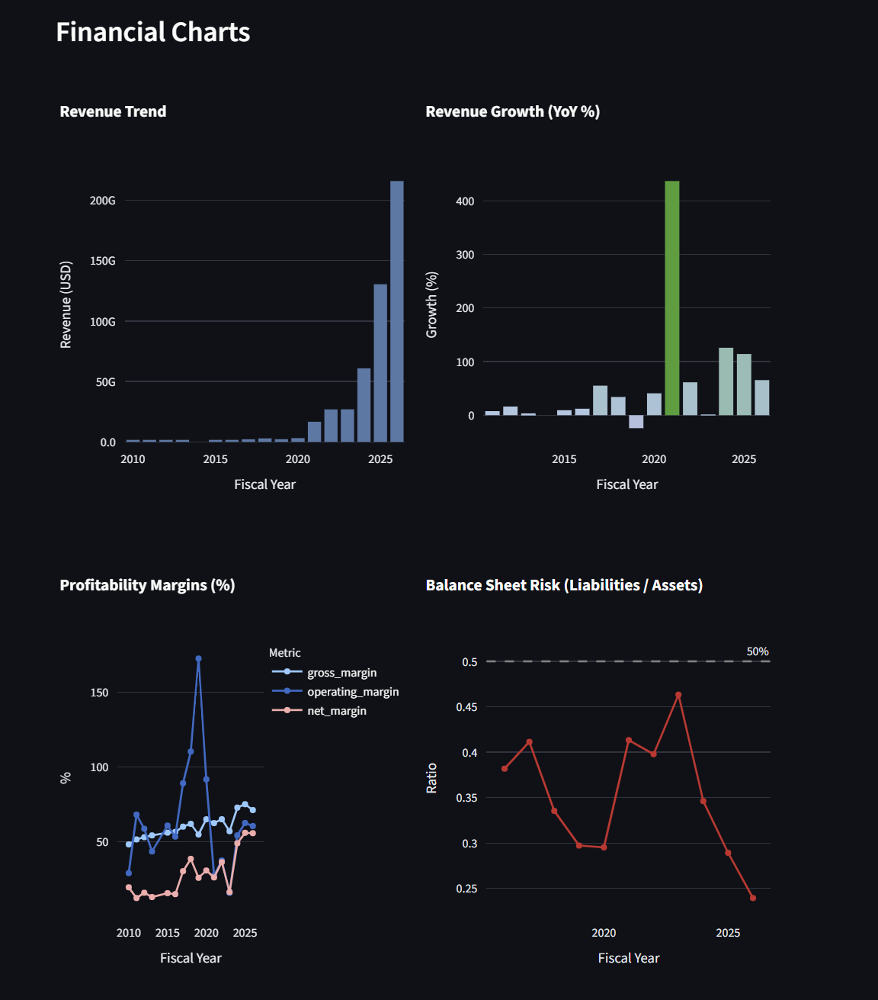

# FinSight Agent

**SEC Filing-Based Financial Anomaly Detection & Event Attribution System**

FinSight Agent collects structured XBRL financial data from SEC EDGAR, calculates key financial metrics, detects abnormal changes in fundamentals using statistical and rule-based methods, and uses an LLM to attribute anomalies to material corporate events disclosed in 8-K, 10-Q, and 10-K filings.

When an anomaly cannot be explained by any matching disclosure, it is flagged as an **unexplained anomaly** and routed for human review — the system deliberately avoids inventing financial narratives.



---

## Features

| Feature | Description |
|---------|-------------|
| SEC XBRL Collection | Fetches 7 core metrics (revenue, net income, assets, etc.) via the companyfacts API |
| Financial Metrics | Calculates YoY growth, margins, leverage ratios, and cash flow quality metrics |
| Anomaly Detection | Z-score (statistical) + 9 rule-based financial flags, combined |
| Event Attribution | LLM analyzes 10-K → 10-Q → 8-K filings in priority order to explain each anomaly |
| Review Priority | Scores anomalies by severity, type, and whether they remain unexplained |
| Dashboard | Interactive Streamlit app with Plotly charts and streaming AI analysis |

---

## Pipeline

```
Ticker
  → CIK lookup
  → SEC companyfacts API (XBRL)
  → Financial metric calculation (growth, margins, leverage, cash flow)
  → Anomaly detection (z-score / rule-based)
  → SEC submissions API → 8-K / 10-Q / 10-K retrieval
  → LLM event attribution → explained_anomaly | unexplained_anomaly
  → Risk scoring + Streamlit dashboard
```

---

## Getting Started

```bash
# 1. Set up environment
python -m venv .venv
source .venv/bin/activate          # Windows: .venv\Scripts\activate
pip install -r requirements.txt

# 2. Configure API keys
cp .env.example .env
# Edit .env with your SEC_USER_AGENT and OPENAI_API_KEY

# 3. Run the dashboard
streamlit run app/streamlit_app.py
```

---

## Environment Variables

See `.env.example`:

```
SEC_USER_AGENT=YourName your@email.com
OPENAI_API_KEY=sk-...
```

SEC requires a `User-Agent` header on every request and rate-limits automated traffic to 10 requests/second. See the [SEC EDGAR API docs](https://www.sec.gov/search-filings/edgar-application-programming-interfaces).

---

## Project Structure

```
finsight-agent/
├── app/
│   └── streamlit_app.py        # Streamlit dashboard
├── src/
│   ├── sec/                    # EDGAR client, CIK mapper, filing downloader
│   ├── xbrl/                   # XBRL concept mapping, fact extractor
│   ├── metrics/                # Financial metric calculations
│   ├── anomaly/                # Anomaly detection + risk scoring
│   ├── events/                 # Filing retrieval + HTML parsing
│   ├── llm/                    # Event attribution prompts + analyzer
│   └── schemas/                # Pydantic models
├── scripts/                    # CLI smoke tests
├── data/
│   ├── cache/                  # Cached SEC API responses
│   └── outputs/                # Generated reports
└── requirements.txt
```

---

## Development Log

- [x] **Day 1** — SEC API client, CIK mapper, companyfacts fetcher
- [x] **Day 2** — XBRL fact extractor + us-gaap concept mapping
- [x] **Day 3** — Financial metric builder (YoY growth, margins, leverage, cash flow ratios)
- [x] **Day 4** — Streamlit dashboard + Plotly charts
- [x] **Day 5** — Anomaly detection (z-score + 9 rule-based financial flags)
- [x] **Day 6** — Filing retrieval + HTML parsing + keyword-based section extraction
- [x] **Day 7** — LLM event attribution + risk scoring

---

## Design Principles

- **Data first, narrative last.** Every claim in the output is traceable to a specific XBRL fact or SEC filing.
- **Explained vs. unexplained.** Anomalies without a supporting filing are surfaced as `unexplained_anomaly`, not silently dropped or fabricated.
- **No hallucinated attribution.** LLM prompts are structured to allow "no match" as a first-class answer.
- **Human review as a feature.** Unexplained anomalies increase, not decrease, the company's review priority score.
